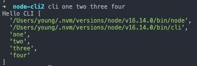
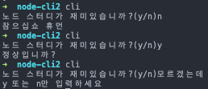

# Node.js 교과서 정리 14, CLI 프로그램 만들기

명령줄 인터페이스(Command Line Interface) 기반으로 동작하는 노드 프로그램 만들기
- CLI는 콘솔 창을 통해 프로그램을 수행하는 환경을 뜻함, 반대는 GUI (Graphic User Interface)

## 핵심 정리
- 노드는 단순히 서버가 아니라 자바스크립트를 실행하는 런타임
- npm에서 서버를 위한 패키지뿐만 아니라 프로그램을 위한 패키지도 준비돼 있으므로 적극 활용할 것
- 다른 사람이 사용할 것을 감안해 명령어에 대한 설명을 자세히 적어둘 것
- 프로그래머의 소양 중 하나는 DRY(Don't Repeat Yourself) 간단한 프로그램만으로도 의미 없이 반복되는 단순 작업을 줄일 수 있음
	- CLI 프로그램을 만드는 법을 익혔으니 반복잡업을 줄이는 프로그램을 만들어 쓰세요^^


## 14.1 간단한 콘솔 명령어 만들기
- node나 npm, nodemon처럼 콘솔에서 입력하여 어떤 동작을 수행하는 문장을 콘솔 명령어라고 함
- 명령어는 해당 패키지를 npm을 통해 전역(-g 옵션) 설치하면 콘솔에서 명령어로 사용할 수 있음

- cli 프로그램을 위한 npm 모듈 생성

```json
{
  "name": "node-cli",
  "version": "1.0.0",
  "description": "nodejs cli program",
  "main": "index.js",
  "author": "young",
  "license": "ISC"
}
```

- index.js 생성, 첫 줄의 주석은 리눅스나 맥같은 유닉스 OS에선 /usr/bin/env에 등록된 node 명령어로 이 파일을 실행하라는 뜻
	- windows에선 단지 주석으로 인식

```js
#!/usr/bin/env node
console.log('Hello CLI');
```

- bin 속성이 콘솔 명령어와 해당 명령어를 호출할 때 실행 파일을 설정하는 객체

```json
# pacakage.json
{
    ...
    "bin": {
        "cli": "./index.js"
    }
}
```

- 콘솔에서 현재 패키지를 전역 설치, 보통 전역 설치 시 명령어에 패키지명을 함께 적지만 현재 패키지를 전역 설치할 땐 적지 않음

```bash
npm i -g
```

- 인스톨 후 "cli" 커맨드 입력 시 콘솔창에 "Hello CLI"가 표시되는 것을 확인가능
- bin/index.js를 실행 파일로 연결해두어 index.js 변경 시 재 인스톨은 필요 없이 index.js파일만 수정해주면 됨
- process.argv 를 사용하면 커맨드 입력시 입력한 인수들을 볼 수 있음

```js
console.log('Hello CLI', process.argv);
```

```bash
cli one two three four
```

<p align="center"></p>

- 내장 모듈인 realine을 사용하면 사용자로부터 입력을 받을 수 있음
	- realine은 한 줄 씩 읽을 수 있는 스트림으로부터 인터페이스를 제공해주는 모듈
	- createInterface 메서드로 IO를 설정한 rl객체를 생성 가능
	- requestion 메서드로 질문 가능
		- 첫 번째 인수는 질문내용
		- 두 번째 인수는 매개변수로 답변을 인수로 받는 콜백 함수

```js
#!/usr/bin/env node
const readline = require('readline');

const rl = readline.createInterface({
    input: process.stdin,
    output: process.stdout,
});

rl.question('노드 스터디가 재미있습니까?(y/n)', (answer) => {
    if (answer === 'y') {
        console.log('정상입니까?');
    } else if (answer ==='n') {
        console.log('참으십쇼 휴먼');
    } else {
        console.log('y 또는 n만 입력하세요');
    }
    rl.close();
});
```

<p align="center"></p>

- 템플릿 파일을 만들어주는 프로그램
	- 명령어 타입 이름 디렉토리명 을 입력받으면 바로 생성하지만 외우기 힘들기 때문에 타입 이름 디렉토리명을 입력 안받은 경우도 순서대로 입력해 설정할 수 있도록 설계

```js
#!/usr/bin/env node
const fs = require('fs');
const path = require('path');
const readline = require('readline');

let rl;
let type = process.argv[2];
let name = process.argv[3];
let directory = process.argv[4] || '.';

const htmlTemplate = `
<!DOCTYPE html>
<html>
  <head>
    <meta charset="utf-8" />
    <title>Template</title>
  </head>
  <body>
    <h1>Hello</h1>
    <p>CLI</p>
  </body>
</html>
`;

const routerTemplate = `
const express = require('express');
const router = express.Router();
 
router.get('/', (req, res, next) => {
   try {
     res.send('ok');
   } catch (error) {
     console.error(error);
     next(error);
   }
});
 
module.exports = router;
`;

const exist = (dir) => { // 폴더 존제 확인 함수
  try {
    fs.accessSync(dir, fs.constants.F_OK | fs.constants.R_OK | fs.constants.W_OK);
    return true;
  } catch (e) {
    return false;
  }
};

const mkdirp = (dir) => { // 경로 생성 함수
  const dirname = path
    .relative('.', path.normalize(dir))
    .split(path.sep)
    .filter(p => !!p);
  dirname.forEach((d, idx) => {
    const pathBuilder = dirname.slice(0, idx + 1).join(path.sep);
    if (!exist(pathBuilder)) {
      fs.mkdirSync(pathBuilder);
    }
  });
};

const makeTemplate = () => { // 템플릿 생성 함수
  mkdirp(directory);
  if (type === 'html') {
    const pathToFile = path.join(directory, `${name}.html`);
    if (exist(pathToFile)) {
      console.error('이미 해당 파일이 존재합니다');
    } else {
      fs.writeFileSync(pathToFile, htmlTemplate);
      console.log(pathToFile, '생성 완료');
    }
  } else if (type === 'express-router') {
    const pathToFile = path.join(directory, `${name}.js`);
    if (exist(pathToFile)) {
      console.error('이미 해당 파일이 존재합니다');
    } else {
      fs.writeFileSync(pathToFile, routerTemplate);
      console.log(pathToFile, '생성 완료');
    }
  } else {
    console.error('html 또는 express-router 둘 중 하나를 입력하세요.');
  }
};

const dirAnswer = (answer) => { // 경로 설정
  directory = (answer && answer.trim()) || '.';
  rl.close();
  makeTemplate();
};

const nameAnswer = (answer) => { // 파일명 설정
  if (!answer || !answer.trim()) {
    console.clear();
    console.log('name을 반드시 입력하셔야 합니다.');
    return rl.question('파일명을 설정하세요. ', nameAnswer);
  }
  name = answer;
  return rl.question('저장할 경로를 설정하세요.(설정하지 않으면 현재경로) ', dirAnswer);
};

const typeAnswer = (answer) => { // 템플릿 종류 설정
  if (answer !== 'html' && answer !== 'express-router') {
    console.clear();
    console.log('html 또는 express-router만 지원합니다.');
    return rl.question('어떤 템플릿이 필요하십니까? ', typeAnswer);
  }
  type = answer;
  return rl.question('파일명을 설정하세요. ', nameAnswer);
};

const program = () => {
  if (!type || !name) {
    rl = readline.createInterface({
      input: process.stdin,
      output: process.stdout,
    });
    console.clear();
    rl.question('어떤 템플릿이 필요하십니까? ', typeAnswer);
  } else {
    makeTemplate();
  }
};

program(); // 프로그램 실행부
```

- 전역으로 설치했던 cli 프로그램 삭제

```bash
npm rm -g node-cli
```

## 14.2 commander, inquirer 사용하기

