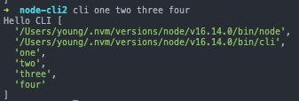
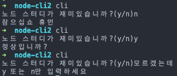
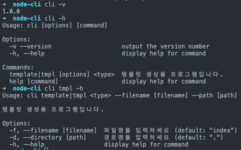
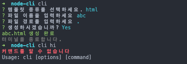

# Node.js 교과서 정리 14, CLI 프로그램 만들기

명령줄 인터페이스(Command Line Interface) 기반으로 동작하는 노드 프로그램 만들기
- CLI는 콘솔 창을 통해 프로그램을 수행하는 환경을 뜻함, 반대는 GUI (Graphic User Interface)

## 핵심 정리
- 노드는 단순히 서버가 아니라 자바스크립트를 실행하는 런타임
- npm에서 서버를 위한 패키지뿐만 아니라 프로그램을 위한 패키지도 준비돼 있으므로 적극 활용할 것
- 다른 사람이 사용할 것을 감안해 명령어에 대한 설명을 자세히 적어둘 것
- 프로그래머의 소양 중 하나는 DRY(Don't Repeat Yourself) 간단한 프로그램만으로도 의미 없이 반복되는 단순 작업을 줄일 수 있음
	- CLI 프로그램을 만드는 법을 익혔으니 반복잡업을 줄이는 프로그램을 만들어 쓰세요^^


## 14.1 간단한 콘솔 명령어 만들기
- node나 npm, nodemon처럼 콘솔에서 입력하여 어떤 동작을 수행하는 문장을 콘솔 명령어라고 함
- 명령어는 해당 패키지를 npm을 통해 전역(-g 옵션) 설치하면 콘솔에서 명령어로 사용할 수 있음

- cli 프로그램을 위한 npm 모듈 생성

```json
{
  "name": "node-cli",
  "version": "1.0.0",
  "description": "nodejs cli program",
  "main": "index.js",
  "author": "young",
  "license": "ISC"
}
```

- index.js 생성, 첫 줄의 주석은 리눅스나 맥같은 유닉스 OS에선 /usr/bin/env에 등록된 node 명령어로 이 파일을 실행하라는 뜻
	- windows에선 단지 주석으로 인식

```js
#!/usr/bin/env node
console.log('Hello CLI');
```

- bin 속성이 콘솔 명령어와 해당 명령어를 호출할 때 실행 파일을 설정하는 객체

```js
{
    ...
    "bin": {
        "cli": "./index.js"
    }
}
```

- 콘솔에서 현재 패키지를 전역 설치, 보통 전역 설치 시 명령어에 패키지명을 함께 적지만 현재 패키지를 전역 설치할 땐 적지 않음

```bash
npm i -g
```

- 인스톨 후 "cli" 커맨드 입력 시 콘솔창에 "Hello CLI"가 표시되는 것을 확인가능
- bin/index.js를 실행 파일로 연결해두어 index.js 변경 시 재 인스톨은 필요 없이 index.js파일만 수정해주면 됨
- process.argv 를 사용하면 커맨드 입력시 입력한 인수들을 볼 수 있음

```js
console.log('Hello CLI', process.argv);
```

```bash
cli one two three four
```

<p align="center"></p>

- 내장 모듈인 realine을 사용하면 사용자로부터 입력을 받을 수 있음
	- realine은 한 줄 씩 읽을 수 있는 스트림으로부터 인터페이스를 제공해주는 모듈
	- createInterface 메서드로 IO를 설정한 rl객체를 생성 가능
	- requestion 메서드로 질문 가능
		- 첫 번째 인수는 질문내용
		- 두 번째 인수는 매개변수로 답변을 인수로 받는 콜백 함수

```js
#!/usr/bin/env node
const readline = require('readline');

const rl = readline.createInterface({
    input: process.stdin,
    output: process.stdout,
});

rl.question('노드 스터디가 재미있습니까?(y/n)', (answer) => {
    if (answer === 'y') {
        console.log('정상입니까?');
    } else if (answer ==='n') {
        console.log('참으십쇼 휴먼');
    } else {
        console.log('y 또는 n만 입력하세요');
    }
    rl.close();
});
```

<p align="center"></p>

- 템플릿 파일을 만들어주는 프로그램
	- 명령어 타입 이름 디렉토리명 을 입력받으면 바로 생성하지만 외우기 힘들기 때문에 타입 이름 디렉토리명을 입력 안받은 경우도 순서대로 입력해 설정할 수 있도록 설계


<details><summary>코드보기</summary>

```js
#!/usr/bin/env node
const fs = require('fs');
const path = require('path');
const readline = require('readline');

let rl;
let type = process.argv[2];
let name = process.argv[3];
let directory = process.argv[4] || '.';

const htmlTemplate = `
<!DOCTYPE html>
<html>
  <head>
    <meta charset="utf-8" />
    <title>Template</title>
  </head>
  <body>
    <h1>Hello</h1>
    <p>CLI</p>
  </body>
</html>
`;

const routerTemplate = `
const express = require('express');
const router = express.Router();
 
router.get('/', (req, res, next) => {
   try {
     res.send('ok');
   } catch (error) {
     console.error(error);
     next(error);
   }
});
 
module.exports = router;
`;

const exist = (dir) => { // 폴더 존제 확인 함수
  try {
    fs.accessSync(dir, fs.constants.F_OK | fs.constants.R_OK | fs.constants.W_OK);
    return true;
  } catch (e) {
    return false;
  }
};

const mkdirp = (dir) => { // 경로 생성 함수
  const dirname = path
    .relative('.', path.normalize(dir))
    .split(path.sep)
    .filter(p => !!p);
  dirname.forEach((d, idx) => {
    const pathBuilder = dirname.slice(0, idx + 1).join(path.sep);
    if (!exist(pathBuilder)) {
      fs.mkdirSync(pathBuilder);
    }
  });
};

const makeTemplate = () => { // 템플릿 생성 함수
  mkdirp(directory);
  if (type === 'html') {
    const pathToFile = path.join(directory, `${name}.html`);
    if (exist(pathToFile)) {
      console.error('이미 해당 파일이 존재합니다');
    } else {
      fs.writeFileSync(pathToFile, htmlTemplate);
      console.log(pathToFile, '생성 완료');
    }
  } else if (type === 'express-router') {
    const pathToFile = path.join(directory, `${name}.js`);
    if (exist(pathToFile)) {
      console.error('이미 해당 파일이 존재합니다');
    } else {
      fs.writeFileSync(pathToFile, routerTemplate);
      console.log(pathToFile, '생성 완료');
    }
  } else {
    console.error('html 또는 express-router 둘 중 하나를 입력하세요.');
  }
};

const dirAnswer = (answer) => { // 경로 설정
  directory = (answer && answer.trim()) || '.';
  rl.close();
  makeTemplate();
};

const nameAnswer = (answer) => { // 파일명 설정
  if (!answer || !answer.trim()) {
    console.clear();
    console.log('name을 반드시 입력하셔야 합니다.');
    return rl.question('파일명을 설정하세요. ', nameAnswer);
  }
  name = answer;
  return rl.question('저장할 경로를 설정하세요.(설정하지 않으면 현재경로) ', dirAnswer);
};

const typeAnswer = (answer) => { // 템플릿 종류 설정
  if (answer !== 'html' && answer !== 'express-router') {
    console.clear();
    console.log('html 또는 express-router만 지원합니다.');
    return rl.question('어떤 템플릿이 필요하십니까? ', typeAnswer);
  }
  type = answer;
  return rl.question('파일명을 설정하세요. ', nameAnswer);
};

const program = () => {
  if (!type || !name) {
    rl = readline.createInterface({
      input: process.stdin,
      output: process.stdout,
    });
    console.clear();
    rl.question('어떤 템플릿이 필요하십니까? ', typeAnswer);
  } else {
    makeTemplate();
  }
};

program(); // 프로그램 실행부
```

</details>
<br/>

- 전역으로 설치했던 cli 프로그램 삭제

```bash
npm rm -g node-cli
```

## 14.2 commander, inquirer 사용하기
- 책에선 commander, inquirer, chalk 패키지를 사용한 예제 제공
- 우선 commander 메서드들을 사용해 명령어 실행 시 사용법을 제공
	- version - 프로그램의 버전 설정
	- name - 명령어의 이름
	- usage - 명령어의 사용법을 설정 가능
	- command - 명령어를 설정하는 메서드
		- 예제에선  template <type> 과 * 두 가지 커맨드를 만듦
			- cli copy처럼 미리 등록하지 않은 명령어를 사용하면 * 와일드카드 명령어가 실행됨
		- '<>' 는 필수 입력
	- description - 명령어에 대한 설명을 설정하는 메서드
	- alias - 명령어 별칭을 설정 가능
	- option - 명령어에 대한 부가옵션 설정 가능
		- name 옵션은 name 메서드와 곂칠 수 있으므로 사용하지 않는게 좋음
	- requiredOption - option과 같은 역할을 하지만 필수로 입력해야 하는 옵션을 지정할 때 사용
	- action - 명령어에 대한 실제 동작을 정의하는 메서드
		- <type>과 같은 필수 요소나 옵션들을 매개변수로 가져올 수 있음
	- help - 설명서를 보여주는 옵션
	- parse - program 객체의 마지막에 붙이는 메서드, process.argv를 인수로 받아 명려어와 옵션을 파싱함

```js
#!/usr/bin/env node
const { program } = require('commander');

program
    .version('1.0.0', '-v --version')
    .name('cli');

program
    .command('template <type>')
    .usage('<type> --filename [filename] --path [path]')
    .description('it makes a template')
    .alias('tmpl')
    .option('-f, --filename [filename]', 'input your file name', 'index')
    .option('-d, --directory [path]', 'input directory where the template made', '.')
    .action((type, options) => {
        console.log(type, options.filename, option.directory);
    });

program
    .command('*', { noHelp: true })
    .action(() => {
        console.log("can't find the command");
        program.help();
    });

program.parse(process.argv);
```

<p align="center"></p>

- 아까 template.js내용을 추가
	- commander 모듈을 사용하더라도 여전히 명령어를 외워야 함

<details><summary>코드보기</summary>

```js
#!/usr/bin/env node

const {
    program
} = require('commander');
const fs = require('fs');
const path = require('path');

const htmlTemplate = `
<!DOCTYPE html>
<html>
  <head>
    <meta charset="utf-8" />
    <title>Template</title>
  </head>
  <body>
    <h1>Hello</h1>
    <p>CLI</p>
  </body>
</html>
`;

const routerTemplate = `
const express = require('express');
const router = express.Router();
 
router.get('/', (req, res, next) => {
   try {
     res.send('ok');
   } catch (error) {
     console.error(error);
     next(error);
   }
});
 
module.exports = router;
`;

const exist = (dir) => { // 폴더 존제 확인 함수
    try {
        fs.accessSync(dir, fs.constants.F_OK | fs.constants.R_OK | fs.constants.W_OK);
        return true;
    } catch (e) {
        return false;
    }
};

const mkdirp = (dir) => { // 경로 생성 함수
    const dirname = path
        .relative('.', path.normalize(dir))
        .split(path.sep)
        .filter(p => !!p);
    dirname.forEach((d, idx) => {
        const pathBuilder = dirname.slice(0, idx + 1).join(path.sep);
        if (!exist(pathBuilder)) {
            fs.mkdirSync(pathBuilder);
        }
    });
};

const makeTemplate = (type, name, directory) => { // 템플릿 생성 함수
    mkdirp(directory);
    if (type === 'html') {
      const pathToFile = path.join(directory, `${name}.html`);
      if (exist(pathToFile)) {
        console.error('이미 해당 파일이 존재합니다');
      } else {
        fs.writeFileSync(pathToFile, htmlTemplate);
        console.log(pathToFile, '생성 완료');
      }
    } else if (type === 'express-router') {
      const pathToFile = path.join(directory, `${name}.js`);
      if (exist(pathToFile)) {
        console.error('이미 해당 파일이 존재합니다');
      } else {
        fs.writeFileSync(pathToFile, routerTemplate);
        console.log(pathToFile, '생성 완료');
      }
    } else {
      console.error('html 또는 express-router 둘 중 하나를 입력하세요.');
    }
  };

const dirAnswer = (answer) => { // 경로 설정
    directory = (answer && answer.trim()) || '.';
    rl.close();
    makeTemplate();
};

const nameAnswer = (answer) => { // 파일명 설정
    if (!answer || !answer.trim()) {
        console.clear();
        console.log('name을 반드시 입력하셔야 합니다.');
        return rl.question('파일명을 설정하세요. ', nameAnswer);
    }
    name = answer;
    return rl.question('저장할 경로를 설정하세요.(설정하지 않으면 현재경로) ', dirAnswer);
};

const typeAnswer = (answer) => { // 템플릿 종류 설정
    if (answer !== 'html' && answer !== 'express-router') {
        console.clear();
        console.log('html 또는 express-router만 지원합니다.');
        return rl.question('어떤 템플릿이 필요하십니까? ', typeAnswer);
    }
    type = answer;
    return rl.question('파일명을 설정하세요. ', nameAnswer);
};

program
    .version('1.0.0', '-v --version')
    .name('cli');

program
    .command('template <type>')
    .usage('<type> --filename [filename] --path [path]')
    .description('템플릿 생성용 프로그램입니다.')
    .alias('tmpl')
    .option('-f, --filename [filename]', '파일명을 입력하세요', 'index')
    .option('-d, --directory [path]', '경로명을 입력하세요', '.')
    .action((type, options) => {
        makeTemplate(type, options.filename, options.directory);
    });

program
    .command('*', {
        noHelp: true
    })
    .action(() => {
        console.log("커맨드를 알 수 없습니다");
        program.help();
    });

program.parse(process.argv);
```

</details>
<br/>

- inquirer 모듈을 사용하면 cli 명령어를 사용할 때 사용자와 상호작용 가능
	- readline 모듈을 썼을 때보다 코드가 간결해짐(inquirer 패키지 내에서 readline 모듈을 사용한다고 함)
	- inquirer 객체는 prompt란 메서드를 가짐, 인수로 질문 목록을 받고, 프로미스를 통해 답변 객체를 반환함
		- 질문 객체 속성
			- type - 질문의 종류(input, checkbox, list, password, confirm 등)
			- name - 질문의 이름, 답변 객체가 갖는 속성값
			- message - 사용자에게 표시되는 문자열
			- choices - 타입이 checkbox, list인 경우 선택지를 넣는 곳
			- default - 답을 적지 않을 경우 기본값

```js
const inquirer = require('inquirer');
...
program
    .command('template <type>')
    .usage('<type> --filename [filename] --path [path]')
    .description('템플릿 생성용 프로그램입니다.')
    .alias('tmpl')
    .option('-f, --filename [filename]', '파일명을 입력하세요', 'index')
    .option('-d, --directory [path]', '경로명을 입력하세요', '.')
    .action((type, options) => {
        makeTemplate(type, options.filename, options.directory);
    });

program
    .action((cmd, args) => {
        if (args) {
            console.log("커맨드를 알 수 없습니다");
            program.help();
        } else {
            inquirer.prompt([{
                type: 'list',
                name: 'type',
                message: '템플릿 종류를 선택하세요.',
                choices: ['html', 'express-router'],  
            }, {
                type: 'input',
                name: 'name',
                message: '파일 이름을 입력하세요',
                default: 'index',
            }, {
                type: 'input',
                name: 'directory',
                message: '파일 경로를 입력하세요',
                default: '.',
            }, {
                type: 'confirm',
                name: 'confirm',
                message: '생성하시겠습니까?',
            }])
                .then(answers => {
                    if (answers.confirm) {
                        makeTemplate(answers.type, answers.name, answers.directory);
                        console.log('터미널을 종료합니다.')
                    }
                });
        }
    });

program.parse(process.argv);
```


- chalk 패키지를 사용하여 터미널에 색과 스타일 추가
	- chalk 객체의 메서드들로 문자열을 감싸면 됨, 익숙한 색은 메서드로 기본 제공
	- 글자색 외에도 배경색, 텍스트 스타일도 줄 수 있음
	- 단, 터미널마다 지원하는 색과 스타일이 다르므로 모든 환경에서 같게 동작하진 않음

```js
// 기본 색상은 메서드로 지원
chalk.red(text);

// 커스텀 색상 사용 시
chalk.rgb(r,g,b)(text);
chalk.hex('#000000')(text);

// 이런식으로 메서드 체이닝으로 스타일을 줄 수 있음
chalk.red.bgBlue.bold(text);
```

```js
const makeTemplate = (type, name, directory) => { // 템플릿 생성 함수
    mkdirp(directory);
    if (type === 'html') {
      const pathToFile = path.join(directory, `${name}.html`);
      if (exist(pathToFile)) {
        console.error(chalk.bold.red('이미 해당 파일이 존재합니다'));
      } else {
        fs.writeFileSync(pathToFile, htmlTemplate);
        console.log(chalk.green(pathToFile, '생성 완료'));
      }
    } else if (type === 'express-router') {
      const pathToFile = path.join(directory, `${name}.js`);
      if (exist(pathToFile)) {
        console.error(chalk.bold.red('이미 해당 파일이 존재합니다'));
      } else {
        fs.writeFileSync(pathToFile, routerTemplate);
        console.log(chalk.green(pathToFile, '생성 완료'));
      }
    } else {
      console.error(chalk.bold.red('html 또는 express-router 둘 중 하나를 입력하세요.'));
    }
  };
..
program
    .action((cmd, args) => {
        if (args) {
            console.log(chalk.bold.red("커맨드를 알 수 없습니다"));
            program.help();
        } else {
            inquirer.prompt([{
                type: 'list',
                name: 'type',
                message: '템플릿 종류를 선택하세요.',
                choices: ['html', 'express-router'],  
            }, {
                type: 'input',
                name: 'name',
                message: '파일 이름을 입력하세요',
                default: 'index',
            }, {
                type: 'input',
                name: 'directory',
                message: '파일 경로를 입력하세요',
                default: '.',
            }, {
                type: 'confirm',
                name: 'confirm',
                message: '생성하시겠습니까?',
            }])
                .then(answers => {
                    if (answers.confirm) {
                        makeTemplate(answers.type, answers.name, answers.directory);
                        console.log(chalk.rgb(128,128,128)('터미널을 종료합니다.'));
                    }
                });
        }
    });
```

<p align="center"></p>

## 14.3.1 스스로 해보기
- 해보세요~


## [느낌표 두개 (Double Exclamation Marks)](https://stackoverflow.com/questions/784929/what-is-the-not-not-operator-in-javascript)
- nonboolean형 타입을 boolean 형으로 바꾸기 위해 사용
- 연산자(Operator)는 아니고 단지 두 번의 부정을 수행하는 것

```js
// 아래와 두 결과는 같음
Boolean(5) === !!5;

!!false === false
!!true === true

!!0 === false
!!parseInt('foo') === false // NaN is falsey
!!1 === true
!!-1 === true // -1 is truthy
!!(1/0) === true // Infinity is truthy

!!'' === false // empty string is falsey
!!'foo' === true // non-empty string is truthy
!!'false' === true // ...even if it contains a falsey value

!!window.foo === false // undefined value is falsey
!!undefined === false // undefined primitive is falsey
!!null === false // null is falsey

!!{} === true // an (empty) object is truthy
!![] === true // an (empty) array is truthy;

!!new Boolean(false) // 객체니까 truthy 때문에 true
!!Boolean(false) // false
```
