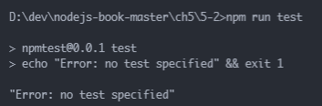
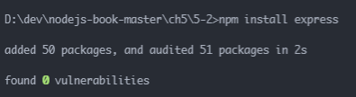
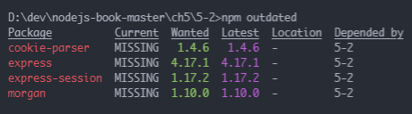
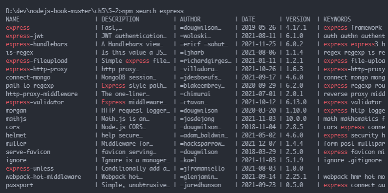
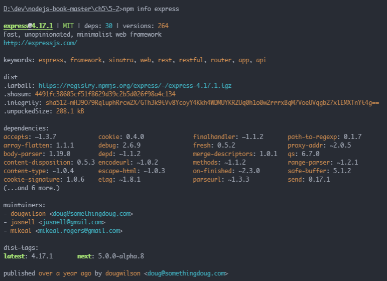
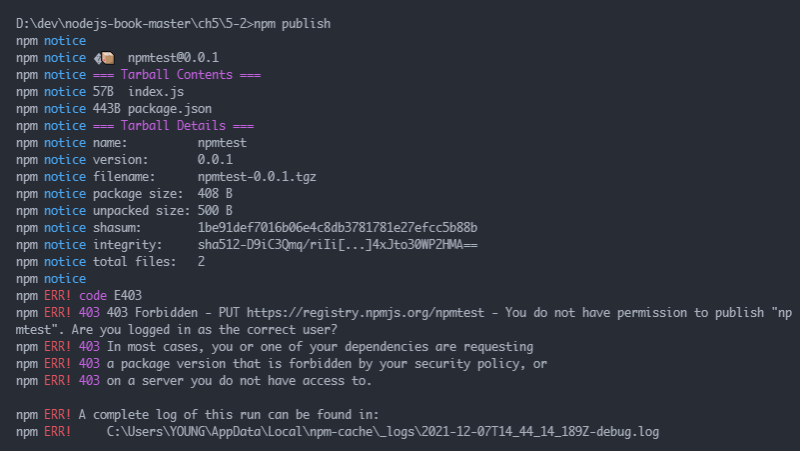
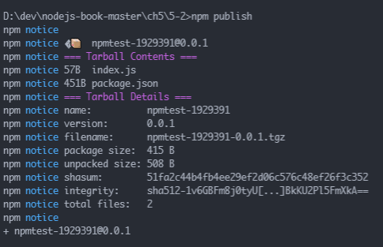
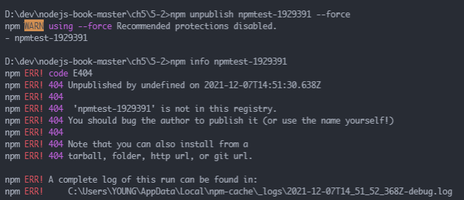

# 노드 JS 스터디 5장 패키지 매니저

## 5.1 npm 알아보기

* **npm(Node Package Manager), 노드 패키지 매니저**
	* https://www.npmjs.com/
	* 대부분의 JS 프로그램은 패키지라는 이름으로 npm에 등록돼 있어 필요하면 npm에서 찾아 설치하면 됨
	* npm의 대체제로 `yarn`도 있음

## 5.2 package.json으로 패키지 관리하기

* 패키지 버전을 관리하는 파일이 **pakage.json**
* 노드 프로젝트를 시작하기 전에 폴더 내부에 package.json부터 만들고 시작

```bash
// npm은 package.json을 만드는 명령어를 제공함
npm init
```

* npm init 실행 시 아래 항목들이 `package.json`에 포함됨, 추후에 필요하면 직접 수정가능
	* **package name** - 패키지명
		* package.json name 속성에 저장됨
	* **version** - 패키지 버전
	* **entry point** - JS 실행 진입점
		* 보통 마지막으로 module.exports하는 파일을 지정
		* package.json main속성으로 저장됨
	* **test command** - 코드를 테스트할 때 입력할 명령어
		* package.json scripts 속성안의 test 속성에 저장됨
	* **git repository** - 코드를 저장해둔 깃(Git) 저장소 주소
		* package.json repository 속성에 저장됨
	* **keywords** - npm 홈페이지에서 패키지를 쉽게 찾을 수 있게 해줌
		* package.json keywords 속성에 저장됨
	* **license** - 라이선스
		* 오픈 소스도 라이선스에 따라 상용 프로그램 개발 시 법적 문제 또는 제약이 생길 수 있어 확인 필수
		* **ISC, MIT, BSD**
			* 사용한 패키지와 라이선스만 밝히면 자유롭게 사용가능
		* **아파치**
			* 사용은 자유롭지만 특허권에 대한 제한이 포함됨
		* **GPL**
			* GPL 패키지 사용 시 자신의 패키지도 GPL로 배포하고 소스 코드도 공개해야 함


```json
{
  "name": "npmtest",
  "version": "0.0.1",
  "description": "hello package.json",
  "main": "index.js",
  "scripts": {
    "test": "echo \"Error: no test specified\" && exit 1"
  },
  "author": "young",
  "license": "ISC"
}
```

* scripts 부분은 npm 명령어를 저장해두는 부분

```bash
npm run [스크립트 명령어]
```

<p align="center"></p>

* 패키지 설치
	* 설치 중 표시되는 ERROR만 진짜 에러고 WARN은 경고로 무시 가능

```bash
# express 패키지 설치
npm install express

# 여러 모듈 여러 개를 동시에 설치 가능
npm install [패키지1] [패키지2] [...]

# 설치 시 표시되는 아래 문구는 패키지에 있을 수 있는 취약점을 자동으로 검사했다는 의미
... audited [숫자] packages

# npm audit은 패키지의 알려진 취약점을 검사할 수 있는 명령어
```

<p align="center"></p>

```json
{
  "name": "npmtest",
  "version": "0.0.1",
  "description": "hello package.json",
  "main": "index.js",
  "scripts": {
    "test": "echo \"Error: no test specified\" && exit 1"
  },
  "author": "young",
  "license": "ISC",
  "dependencies": {
    "express": "^4.17.1"
  }
}
```

* 패키지를 설치할 때 npm install 명령어에 `--save` 옵션을 붙이는 책이나 블로그를 많이 볼 수 있음
	* dependencies에 패키지 이름을 추가하는 옵션이지만 npm@5부터 기본값으로 설정돼 따로 붙이지 않아도 됨
* 패키지를 설치하면 node_modules란 폴더도 생성되며 그 안에 설치한 패키지들이 들어감
	* 패키지 하나가 다른 여러 패키지에 의존하고, 그 패키지들은 또 다른 패키지에 의존하며 복잡한 의존 관계를 가지며 얽혀 있기 때문에 package.json이 필요함
* 패키지를 설치할 때 `package-lock.json`이란 파일도 생성됨
	* 패키지들 간 내부 의존 관계가 저장된 파일로 npm으로 패키지 설치, 수정, 삭제 시 수정됨
* 개발용 패키지 설치
	* `--save-dev`가 개발용 패키지임을 나타냄

```bash
# 실제 배포 시 사용되지 않고 개발 중에만 사용되는 패키지 설치
npm install --save-dev [패키지] [...]
```

* 개발용 패키지는 **devDependencies** 속성에서 따로 관리함
	* nodemon 패키지는 소스코드가 바뀔 때마다 자동으로 노드를 재실행해주는 패키지

```json
{
  "name": "npmtest",
  "version": "0.0.1",
  "description": "hello package.json",
  "main": "index.js",
  "scripts": {
    "test": "echo \"Error: no test specified\" && exit 1"
  },
  "author": "young",
  "license": "ISC",
  "dependencies": {
    "cookie-parser": "^1.4.6",
    "express": "^4.17.1",
    "express-session": "^1.17.2",
    "morgan": "^1.10.0"
  },
  "devDependencies": {
    "nodemon": "^2.0.15"
  }
}
```

* npm에는 **전역(global)** 설치란 옵션도 있음
	* 패키지를 현재 폴더의 node_modules에 설치하는 것이 아니라 npm이 설치된 폴더에 설치 가능
		* 윈도우 - C:\Users\사용자명\AppData\Roaming\npm
		* 맥 - /user/local/lib/node_modules
			* 리눅스나 맥에서는 전역 설치 시 관리자 권한이 필요하므로 sudo를 앞에 붙여야 함
	* 전역 설치한 패키지는 콘솔 명령어로 사용 가능
		* 전역 설치했다고 패키지를 모든 곳에서 사용한다는 뜻은 아니고 대부분 명령어로 사용하기 위해 전역으로 설치함

```bash
# rimraf는 리눅스나 맥의 rm --rf 명령어를 윈도우에서 사용할 수 있게 해주는 패키지
npm install --global rimraf

# node_modules 폴더를 삭제
rimraf node_modules

# 설치한 패키지는 지웠지만 package.json에 설치한 패키지 내역이 있어 npm install로 다시 설치 가능
# 즉, node_modules는 언제든지 npm install로 설치할 수 있어 node_modules는 보관할 필요가 없음
# 때문에 git 같은 버전 관리 프로그램에서도 node_modules 내용은 커밋하지 않음
```

* **npx**
	* 전역 설치 시 package.json에 기록되지 않아 다시 설치할 때 어려움이 따라 전역 설치를 기피하는 개발자들도 있음
	* 이런 경우 npx를 사용하면 패키지를 전역으로 설치한 것과 같은 효과를 얻을 수 있음

```bash
# rimraf 모듈을 전역이 아니게 설치
npm install --save-dev rimraf

# npx 명령어를 붙여 실행 시 패키지를 전역으로 설치한 것과 같은 효과(명령어로 사용 가능)를 얻을 수 있음
npx rimraf node_modules
```

* 모든 패키지가 npm에 등록된 것은 아님, 오픈 소스가 아니거나 개발 중이라 깃허브 등 저장소에 보관돼 있을 수 있음
	* npm에 등록되지 않은 패키지는 아래 명령어로 설치 가능

```bash
npm install [저장소 주소]
```

* 명령어 줄여쓰기

```bash
# npm install
npm i

# npm --save-dev
npm -D

# npm --global
npm -g
```


## 5.3 패키지 버전 이해하기

* 노드 패키지 버전은 SemVer 방식을 따르기 때문에 항상 세 자리로 구성됨
* **SemVer(Semantic Versioning, 유의적 버전)**
	* 버전을 구성하는 세 자리가 모두 의미를 가진다는 의미
	* **첫 번째 자리는 Major 버전**
		* 하위 호환이 되지 않는 변경 시
		* Major 버전이 0이면 초기 개발 중이라는 뜻
		* 1부터 정식 버전을 의미
		* Major 버전은 하위 호환이 안 될 정도로 패키지 내용이 수정된 경우 올림
	* **두 번째 자리는 minor 버전**
		* 하위 호환이 되는 변경 시 
		* minor 버전은 하위 호환이 되는 기능 업데이트를 할 때 올림
	* **세 번째 자리는 patch 버전**
		* 간단한 버그 수정 시
		* 새로운 기능이 추가되었다기 보단 기존 기능에 문제가 있어 수정한 경우 올림
		* 업데이트 후 아무 문제가 없어야 함
* package.json에는 SemVer식 버전 외에도 버전 앞에 ^이나 ~ 또는 >, < 같은 문자가 붙어 있음
	* 이 문자는 버전에는 포함되지 않지만 설치하거나 업데이트할 때 어떤 버전을 설치해야 하는지 알림

```bash
# ^ - minor 버전까지만 설치하거나 업데이트
npm i express^1.1.1        # 1.1.1 이상부터 2.0.0 미만 버전까지 설치됨, 2.0.0은설치되지 않음, 1.x.x와 같이 표현 가능

# ~ - patch 버전까지만 설치하거나 업데이트
npm i express@~1.1.1         # 1.1.1 이상부터 1.2.0 미만 버전까지 설치됨, 1.1.x와 같은  표현도 가능

# minor 버전까지 하위 호환이 보장되기 때문에 ~보다 ^가 많이 사용됨
# >, <, >=, <=, =은 알기 쉽게 초과, 미만, 이상, 이하, 동일을 뜻함
npm i express@>1.1.1         # 반드시 1.1.1버전보다 높은 버전이 설치됨

# 안정된 최신 버전의 패키지를 설치하는 @latest, x로도 표현 가능
npm i express@latest 
npm i express@x

# @next를 사용하면 가장 최근 배포판을 사용 가능, @latest와 다른 점은 안정되지 않은 알파나 베타 버전 패키지를 설치 가능
# 알파나 베타 버전은 1.1.1-alpha.0 이나 2.0.0-beta.1 처럼 표시
# 출시 직전의 패키지는 2.0.0-rc.0 처럼 rc(Release Candidate)가 붙는 경우도 있음
```


## 5.4 기타 npm 명령어

```bash
# 업데이트할 패키지가 있는지 확인하는 명령어
npm outdated
```

* Current와 Wanted가 다르면 업데이트가 필요한 경우
* Latest는 해당 패키지의 최신 버전이지만 package.json에 적힌 버전 범위와 다르다면 설치되지 않음

<p align="center"></p>

```bash
# 아래 명령어로 패키지 업데이트 가능
npm update [패키지명]

# 패키지명을 안쓰면 업데이트 가능한 모든 패키지가 Wanted에 적힌 버전으로 업데이트됨
npm update


# 해당 패키지를 제거하는 명령어, node_modules 폴더와 package.json에서 사라짐
npm uninstall [패키지명]

# 아래처럼 줄여 쓸 수 있음
npm rm [패키지명]

# npm 패키지를 검색할 수 있음(리눅스 등 CUI 환경용), package.json keywords가 이 때 사용됨
npm search [검색어]
```

<p align="center"></p>

```bash
# 패키지 세부 정보를 파악할 때 사용, pakage.json의 내용과 의존 관계, 설치 가능한 버전 정보 등이 표시됨
npm info [패키지명]
```

<p align="center"></p>

```bash
# npm 로그인을 위한 명령어, 패키지 배포 시 로그인이 필요함
npm adduser

# npm adduser로 로그인한 사용자가 누구인지 알림, 비로그인 시 에러 발생
# npm whoami

# npm adduser로 로그인한 계정을 로그아웃할 때 사용
npm logout

# package.json의 버전을 올림
npm version [버전]

# 해당 패키지를 설치할 때 deprecate 경고 메시지를 띄우게 하는 명령어(자신의 패키지에만 이 명령어 적용 가능)
npm deprecate [패키지명] [버전] [메시지]

# 패키지 배포 시 사용
npm publish

# 배포한 패키지를 제거할 때 사용, 24시간 이내에 배포한 패키지만 제거가능 (의존성 관계 때문)
npm unpublish

# package.json 대신 package-lock.json에 기반하여 패키지를 설치, 더 엄격하게 버전을 통제하여 패키지를 설치하고 싶을 때 사용
npm ci

# 기타 명령어 - https://docs.npmjs.com/cli/v8/commands
```


## 5.5 패키지 배포하기

* npm 웹 사이트 회원가입, 로그인
* 패키지로 만들 코드 작성, package.json main 부분의 파일명(패키지 진입점)과 일치해야 함

```js
// index.js
module.exports = () => {
    return "Hello Pakcage";
};
```

* npmtest라는 이름을 누가 이미 사용하여 에러가 발생
	* npm은 패키지의 이름이 겹치는 것을 허용하지 않음
		* 굳이 남이 사용하는 패키지 이름으로 배포하고 싶다면 네임스페이스를 쓰는 방법도 있음


<p align="center"></p>


* 원하는 패키지명이 이미 사용 중이라면?
	* 해당 패키지가 활발히 유지된다면 다른 이름을 사용해야 함
	* 이름만 차지하고 있으면 npm owner Is [패키지명] 으로 해당 패키지 제작자의 이메일을 확인하고 패키지를 유지중인지 문의 메일을 보내고 CC(참조)로 support@npmjs.com을 지정하면 npm 지원팀에게도 메일이 보내짐
		* 패키지명 분쟁에서 당사자들이 합의에 이르지 못할 경우 npm 팀이 나서서 해결해줌

```bash
# 누군가 이름을 사용하고 있는지 확인, 패키지에 대한 정보가 나오면 누군가 사용중인 것
npm info [패키지명]
```

* 유니크한 패키지명으로 변경 후 배포


<p align="center"></p>

* 배포한 패키지 삭제
	* 배포된 패키지는 72시간이 지나면 삭제할 수 없음


<p align="center"></p>

### 배포 시 주의사항
* 배포 시 개인정보가 포함돼 있지 않은지 꼭 확인이 필요
	* 서비스 비밀 키를 넣어 두는 경우 과금이 유발될 수도 있음에 주의
* 패키지명을 선점하는 행위도 삼갈 것
* 기존 패키지와 비슷한 이름으로 배포하거나 일부 수정, 배포 시 꼭 원작자의 허락을 받을 것


## 5.6 함께 보면 좋은 자료

* npm 공식 사이트
	* https://www.npmjs.com/
* yarn 공식 사이트
	* https://yarnpkg.com/
* npm 명령어 설명서
	* https://docs.npmjs.com/
* 패키지 간 비교 사이트
	* https://npmcompare.com/
* 패키지 다운로드 추이 확인
	* https://www.npmtrends.com/
* 패키지명에 네임스페이스 설정하기
	* https://docs.npmjs.com/cli/v8/using-npm/scope


